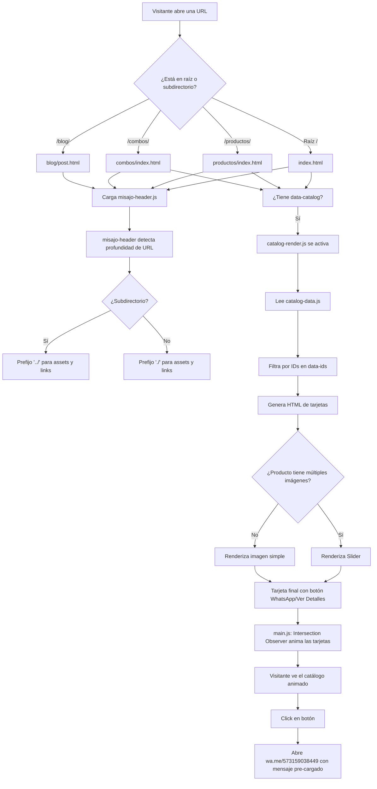

# Guía de Arquitectura — MisajoCookies

> Este documento explica **cómo funciona** el sitio web: su estructura lógica, los patrones de diseño aplicados, el flujo de datos y las decisiones técnicas tomadas.

---

## Visión General

MisajoCookies es un **sitio estático con arquitectura orientada a componentes**, sin framework ni backend. La lógica del lado del cliente se organiza en tres capas:

```
┌─────────────────────────────────────────────────┐
│                  PÁGINAS HTML                   │
│   (index, productos/, combos/, blog/, etc.)     │
└──────────────┬──────────────────────────────────┘
               │ consume
┌──────────────▼──────────────────────────────────┐
│             COMPONENTES WEB                      │
│   misajo-header.js   |   misajo-footer.js        │
└──────────────┬──────────────────────────────────┘
               │ usa datos de
┌──────────────▼──────────────────────────────────┐
│           SISTEMA DE CATÁLOGO                    │
│   catalog-data.js  →  catalog-render.js          │
└──────────────┬──────────────────────────────────┘
               │ apoyado por
┌──────────────▼──────────────────────────────────┐
│            LÓGICA GENERAL (main.js)              │
│   Scroll · Animaciones · Slider · WhatsApp       │
└─────────────────────────────────────────────────┘
```

---

## Diagrama de Flujo del Sistema



---

## Jerarquía de Archivos y Responsabilidades

### Capa de Presentación: Páginas HTML

Cada página HTML sigue una **estructura canónica** idéntica:

```html
<!DOCTYPE html>
<html lang="es">
<head>
    <!-- 1. Meta SEO (title, description, canonical, og:, twitter:) -->
    <!-- 2. Geo-meta tags (region, placename, ICBM) -->
    <!-- 3. Schema.org JSON-LD -->
    <!-- 4. CSS crítico INLINADO (para evitar FOUC en header/hero) -->
    <!-- 5. CSS externo cargado de forma ASÍNCRONA -->
    <!-- 6. Preload de imagen hero (solo en index.html) -->
</head>
<body>
    <!-- 7. Web Component: <misajo-header> -->
    <main>
        <!-- 8. Contenido específico de la página -->
        <!-- 9. Contenedores con data-catalog="products|combos" -->
    </main>
    <!-- 10. Web Component: <misajo-footer> -->
    <!-- 11. Scripts al final del body -->
</body>
</html>
```

**Decisión de diseño:** El CSS crítico se inlinea para que el header y el hero sean visibles antes de que el navegador descargue `styles.css`. Los estilos externos se cargan con el truco `media="print" onload="this.media='all'"` para no bloquear el render.

---

### Capa de Componentes: Web Components

Los Web Components (`misajo-header.js`, `misajo-footer.js`) son **Custom Elements v1** — un estándar nativo del navegador que permite crear etiquetas HTML propias como `<misajo-header>`.

#### Ciclo de vida de `misajo-header`

```
1. El navegador encuentra <misajo-header> en el HTML
2. Llama a connectedCallback()
3. El componente ejecuta _detectBasePath()
4. Analiza window.location.pathname
5. Determina si está en raíz o subdirectorio
6. Construye el HTML del header con rutas correctas
7. Lo inyecta via this.innerHTML
8. Adjunta los event listeners (scroll, hamburger, overlay)
```

#### Detección de profundidad de URL

```javascript
// Lógica simplificada de _detectBasePath()
// Si la URL es /productos/alfajores.html → hay 2 segmentos → es subdirectorio
// Si la URL es /index.html → hay 1 segmento → es raíz

const pathSegments = pathname.split('/').filter(Boolean);
this.basePath = pathSegments.length > 1 ? '../' : './';
this.rootPath = pathSegments.length > 1 ? '../' : '/';
```

**Por qué usar rutas relativas en lugar de absolutas:** Los Web Components son compartidos entre páginas en distintos niveles de directorio. Una ruta como `/assets/css/styles.css` funciona en producción pero puede fallar en algunos entornos locales. La detección dinámica garantiza portabilidad total.

**Por qué Light DOM en lugar de Shadow DOM:** El footer usa `this.innerHTML` (Light DOM), lo que permite que los estilos globales de `styles.css` apliquen directamente. Shadow DOM crearía un árbol de estilos aislado que requeriría duplicar todas las reglas CSS del componente.

---

### Capa de Datos: Sistema de Catálogo

El catálogo funciona como un **mini CMS estático** con separación entre datos y presentación.

#### Estructura de un producto en `catalog-data.js`

```javascript
{
  id: 'alfajores',
  name: 'Alfajores Clásicos',
  description: 'Galletas de maizena rellenas con dulce de leche...',
  price: '$4.000',
  presentation: 'Paquete x 5 unidades',
  images: [
    {
      src: '/assets/images/alfajores.webp',
      alt: 'Alfajores artesanales MisajoCookies Cali',
      width: 1200,
      height: 900
    }
  ],
  whatsapp: 'Hola!%20Quiero%20pedir%20Alfajores%20Clásicos',  // URL-encoded
  url: '/productos/alfajores.html'
}
```

#### Estructura de un combo en `catalog-data.js`

Los combos tienen la misma forma, con la adición de que pueden tener **múltiples imágenes** (variantes del combo). Cuando `images.length > 1`, el renderizador activa automáticamente el slider.

#### Flujo de renderizado en `catalog-render.js`

`catalog-render.js` es un **IIFE** (Immediately Invoked Function Expression) que se ejecuta cuando el DOM está listo:

```
1. Busca todos los elementos con [data-catalog]
2. Por cada contenedor, lee sus atributos:
   - data-catalog="products" | "combos"
   - data-ids="id1,id2,id3"      ← qué productos mostrar
   - data-action="order" | "detail"  ← texto del botón
   - data-heading="h2" | "h3"    ← nivel del título
   - data-limit="3"              ← máximo de items
3. Filtra catalog-data.js según los IDs solicitados
4. Para cada item, llama a buildProductCard() o buildComboCard()
5. Inyecta el HTML generado en el contenedor
6. Si hay sliders, inicializa la clase ImageSlider de main.js
```

**Por qué un IIFE:** Evita contaminar el scope global de JavaScript. Todas las funciones internas (`buildProductCard`, `buildComboCard`, etc.) son privadas al módulo.

**Por qué `data-ids` en lugar de un bucle sobre todos los productos:** Permite que diferentes páginas muestren subconjuntos distintos del catálogo. Por ejemplo, `index.html` muestra solo 3 productos destacados, mientras que `productos/index.html` muestra los 7.

---

### Capa de Lógica: `main.js`

Contiene toda la interactividad que no pertenece al catálogo ni a los componentes.

#### Clases y Funciones Principales

**`class HeroRotator`**
Rota las 3 imágenes del hero cada 6 segundos usando clases CSS (`active`, `behind`, `front`). Actúa como un carrusel de fondo en la sección principal.

```javascript
// Parámetros:
// - containerSelector: string CSS selector del contenedor
// - interval: número en ms (default: 6000)

// Ejemplo de uso implícito (auto-instanciación al cargar):
// new HeroRotator('.hero-images', 6000);
```

**`class ImageSlider`**
Carrusel de imágenes para productos con múltiples fotos (ej: `galletas-topping`, `combo-premium`).

```javascript
// Parámetros:
// - element: HTMLElement del slider
// - autoplayInterval: número en ms (default: 4000)

// Funcionalidades:
// - Botones prev/next
// - Puntos indicadores de posición
// - Auto-play con pausa al hacer hover
// - Si solo hay 1 imagen: oculta controles automáticamente
```

**`function abrirWhatsApp(mensaje)`**
Abre WhatsApp Web/App con un mensaje pre-cargado.

```javascript
// Parámetros:
// - mensaje: string ya codificado en URL (ej: 'Hola%20quiero%20pedir...')

// Retorna: void
// Efecto: abre https://wa.me/573159038449?text=[mensaje]

// Ejemplo de uso:
// abrirWhatsApp('Hola!%20Quiero%20pedir%20Alfajores');
```

**Intersection Observer para animaciones**
En lugar de animar elementos que el usuario no ha visto (desperdicio de recursos), se usa un `IntersectionObserver` que dispara la animación solo cuando la tarjeta entra en el viewport.

```javascript
// Observa todos los elementos con clase .product-card y .combo-card
// Cuando entran en pantalla: añade clase 'visible' → activa fadeInUp
// Después de animar: deja de observar ese elemento (unobserve)
```

**Carga de imágenes lazy**
Imágenes con atributo `data-src` no se cargan hasta estar cerca del viewport. Usa otro `IntersectionObserver` para reemplazar `data-src` por `src` en el momento adecuado.

---

## Patrones de Diseño Utilizados

### 1. Web Components (Custom Elements)
**Dónde:** `misajo-header.js`, `misajo-footer.js`
**Propósito:** Encapsular la navegación global. En lugar de copiar y pegar el mismo HTML en las 20+ páginas del sitio, se declara `<misajo-header>` una vez y el componente se auto-renderiza.
**Analogía:** Es como una plantilla de Word que se aplica automáticamente a todos los documentos de una empresa.

### 2. Single Source of Truth (Única Fuente de Verdad)
**Dónde:** `catalog-data.js`
**Propósito:** El precio, la descripción y las imágenes de cada producto están definidos **una sola vez**. Si el precio cambia, se edita en un lugar y se actualiza en todas las páginas que muestran ese producto.
**Analogía:** Es como la hoja de precios maestra de un restaurante: todos los meseros consultan la misma lista, no cada uno tiene la suya.

### 3. Data Attributes como API de Configuración
**Dónde:** `catalog-render.js` lee `data-catalog`, `data-ids`, `data-action`, etc.
**Propósito:** Permite que los autores de HTML (no-programadores) configuren el comportamiento del catálogo desde el HTML, sin tocar JavaScript.
**Ejemplo:**
```html
<!-- Muestra solo 3 productos con botón "Pedir Ahora" -->
<section data-catalog="products"
         data-ids="galletas-mantequilla,alfajores,cookie-dip-premium"
         data-action="order"
         data-limit="3">
</section>
```

### 4. IIFE (Immediately Invoked Function Expression)
**Dónde:** `catalog-render.js`
**Propósito:** Evitar que variables internas del renderizador contaminen el objeto global `window`. Es el equivalente a un módulo privado en JavaScript pre-ES6.

### 5. Observer Pattern (Patrón Observador)
**Dónde:** `main.js` — `IntersectionObserver` para animaciones y lazy loading
**Propósito:** Los elementos "se suscriben" para ser notificados cuando entran en el viewport, en lugar de que el scroll revise manualmente la posición de cada elemento en cada frame. Es más eficiente y no bloquea el hilo principal.

### 6. Critical CSS Inlining
**Dónde:** Bloque `<style>` en el `<head>` de cada página
**Propósito:** El header y el hero se renderizan correctamente desde el primer frame, sin esperar a que `styles.css` (archivo externo) se descargue. Elimina el "destello de contenido sin estilo" (FOUC).

---

## Flujo Principal: Del Click al Pedido por WhatsApp

Este es el "camino feliz" de un visitante que llega al sitio y hace un pedido.

```
╔══════════════════════════════════════════════════════════╗
║  PASO 1: Llegada                                         ║
║  El visitante abre www.misajocookies.com                 ║
╚══════════════════════════════════════════════════════════╝
                           ↓
El navegador descarga index.html
  → CSS crítico (inlinado) pinta el header y hero al instante
  → styles.css carga de forma asíncrona (no bloquea render)
  → misajo-header.js se registra como Custom Element
  → <misajo-header> se renderiza: logo + navegación

╔══════════════════════════════════════════════════════════╗
║  PASO 2: Visualización del catálogo                      ║
╚══════════════════════════════════════════════════════════╝
                           ↓
catalog-data.js carga la base de datos completa (10 productos + 3 combos)
catalog-render.js detecta los contenedores [data-catalog] en index.html:
  → Sección "Nuestros Productos": data-ids="galletas-mantequilla,galletas-topping,alfajores"
  → Sección "Combos": data-catalog="combos"
  → Para cada ID, construye una tarjeta HTML con imagen, nombre, precio y botón
  → Las tarjetas se inyectan en el DOM

main.js activa el IntersectionObserver:
  → Las tarjetas comienzan invisibles (opacity: 0, translateY: 30px)
  → Cuando el usuario hace scroll y cada tarjeta entra en pantalla:
    → Se añade la clase 'visible'
    → Animación fadeInUp: la tarjeta aparece suavemente

╔══════════════════════════════════════════════════════════╗
║  PASO 3: Selección del producto                          ║
╚══════════════════════════════════════════════════════════╝
                           ↓
El visitante hace click en "Pedir Ahora" en la tarjeta de alfajores

El botón tiene: onclick="abrirWhatsApp('Hola!%20Quiero%20pedir%20Alfajores')"
  → main.js ejecuta abrirWhatsApp()
  → Construye la URL: https://wa.me/573159038449?text=Hola!%20Quiero%20pedir%20Alfajores
  → window.open() abre WhatsApp Web (o la app en móvil)

╔══════════════════════════════════════════════════════════╗
║  RESULTADO                                               ║
║  El visitante inicia una conversación en WhatsApp        ║
║  con el mensaje pre-cargado. MisajoCookies recibe        ║
║  el pedido y coordina la entrega a domicilio.            ║
╚══════════════════════════════════════════════════════════╝
```

---

## Documentación de API de Componentes

### `catalog-data.js` — Estructura de Datos

#### Tipo: `Product`

```javascript
/**
 * @typedef {Object} Product
 * @property {string}   id           - Identificador único. Coincide con el slug de la URL.
 * @property {string}   name         - Nombre legible del producto.
 * @property {string}   description  - Descripción corta (1-2 frases).
 * @property {string}   price        - Precio formateado (ej: "$4.000").
 * @property {string}   presentation - Info del empaque (ej: "Paquete x 5 unidades, 50gr").
 * @property {Image[]}  images       - Array de imágenes. Si length > 1, se activa slider.
 * @property {string}   whatsapp     - Mensaje pre-codificado en URL para WhatsApp.
 * @property {string}   url          - Ruta relativa a la página de detalle del producto.
 */

/**
 * @typedef {Object} Image
 * @property {string} src    - Ruta absoluta a la imagen (ej: "/assets/images/alfajores.webp").
 * @property {string} alt    - Texto alternativo descriptivo y con keywords SEO.
 * @property {number} width  - Ancho en píxeles (1200 para todos los productos).
 * @property {number} height - Alto en píxeles (900 para todos los productos).
 */
```

#### Cómo agregar un nuevo producto

```javascript
// En catalog-data.js, agregar al array window.CATALOG.products:
{
  id: 'galletas-naranja',            // debe coincidir con el nombre del archivo HTML
  name: 'Galletas de Naranja',
  description: 'Galletas artesanales con ralladura de naranja y chocolate blanco.',
  price: '$4.000',
  presentation: 'Paquete x 5 unidades',
  images: [
    {
      src: '/assets/images/galletas-naranja.webp',
      alt: 'Galletas de naranja artesanales MisajoCookies Cali',
      width: 1200,
      height: 900
    }
  ],
  whatsapp: 'Hola!%20Quiero%20pedir%20Galletas%20de%20Naranja%20de%20MisajoCookies',
  url: '/productos/galletas-naranja.html'
}
```

---

### `catalog-render.js` — Atributos de Configuración HTML

| Atributo | Valores | Requerido | Descripción |
|----------|---------|-----------|-------------|
| `data-catalog` | `"products"` \| `"combos"` | Sí | Define qué tipo de items renderizar |
| `data-ids` | Lista separada por comas | No | Filtra qué IDs mostrar. Si se omite, muestra todos |
| `data-action` | `"order"` \| `"detail"` | No | `"order"` → botón "Pedir Ahora" (WhatsApp). `"detail"` → botón "Ver Detalles" (enlace a página de producto). Default: `"order"` |
| `data-heading` | `"h2"` \| `"h3"` | No | Nivel de encabezado para el nombre del producto. Default: `"h3"` |
| `data-limit` | Número entero | No | Limita la cantidad de items renderizados |

**Ejemplo completo:**

```html
<!-- Muestra los 3 combos con heading h2 y botón de pedido -->
<section data-catalog="combos"
         data-heading="h2"
         data-action="order">
</section>

<!-- Muestra solo 2 productos específicos con botón "Ver Detalles" -->
<div data-catalog="products"
     data-ids="cookie-dip-premium,cookie-shaker-supreme"
     data-action="detail"
     data-heading="h3">
</div>
```

---

### `misajo-header.js` — Web Component

```javascript
// Uso en HTML (sin atributos requeridos):
<misajo-header></misajo-header>

// El componente infiere automáticamente su contexto.
// No hay propiedades públicas ni métodos expuestos.
// El comportamiento se controla únicamente a través de la URL actual.
```

**Clases CSS que añade al `<header>`:**
- `.scrolled`: Se añade cuando `window.scrollY > 50`. Activa efecto de fondo opaco.
- `.menu-open`: Se añade cuando el menú hamburguesa está activo.

---

### `misajo-footer.js` — Web Component

```javascript
// Uso en HTML:
<misajo-footer></misajo-footer>

// Renderiza automáticamente:
// - Links de navegación del footer
// - NAP (Nombre, Dirección, Teléfono) de la empresa
// - Año actual dinámico (new Date().getFullYear())
// - Schema.org WPFooter + PostalAddress
```

---

## Rendimiento y Optimizaciones

### Técnicas Implementadas

| Técnica | Impacto | Implementación |
|---------|---------|----------------|
| Critical CSS inlining | Elimina render-blocking | `<style>` en `<head>` con estilos del header/hero |
| Async CSS loading | No bloquea el render | `media="print" onload="this.media='all'"` |
| Image lazy loading | Reduce tiempo de carga inicial | `loading="lazy"` en imágenes fuera del viewport |
| Hero image preload | LCP más rápido | `<link rel="preload" as="image">` para hero-cookie-1.webp |
| WebP format | ~30% menos peso que JPEG | Todas las imágenes en `.webp` |
| Auto-compression CI/CD | Calidad consistente | GitHub Actions: cwebp -q 75 |
| IntersectionObserver | Sin costo en scroll | Animaciones solo cuando el elemento es visible |
| Width/height en imágenes | Elimina CLS | Todos los `` tienen `width` y `height` explícitos |

### Dimensiones Estándar de Imágenes

Todas las imágenes de productos siguen el estándar **1200×900 px (ratio 4:3)** para evitar el Layout Shift (CLS) cuando el navegador reserva el espacio antes de cargar la imagen.

Excepción: `combo-deleite.webp` = 1184×864 px (misma proporción, ligeramente distinto tamaño).

---

## SEO — Estructura de Schema.org

Cada tipo de página implementa un schema diferente:

| Página | Schema Types |
|--------|-------------|
| `index.html` | `Bakery` + `LocalBusiness` |
| `productos/[producto].html` | `Product` + `BreadcrumbList` |
| `combos/index.html` | `ItemList` (implícito) + `BreadcrumbList` |
| `blog/[post].html` | `BlogPosting` + `BreadcrumbList` |
| `nosotros.html` | `LocalBusiness` + `BreadcrumbList` |
| Footer (todas las páginas) | `WPFooter` + `PostalAddress` |

El **NAP** (Name, Address, Phone) debe ser idéntico en todos los schemas y en el contenido visible:
- **Name:** MisajoCookies
- **Address:** Cali, Valle del Cauca, Colombia
- **Phone:** +57 315 903 8449

---

## Guía de Mantenimiento

### Tareas Frecuentes

**Cambiar el precio de un producto:**
```
1. Abrir assets/js/catalog-data.js
2. Buscar el ID del producto
3. Editar la propiedad "price"
4. Guardar y hacer push → el cambio aplica en todas las páginas
```

**Agregar una imagen nueva a un combo (ej: nueva variante):**
```
1. Agregar el archivo .webp a assets/images/
2. En catalog-data.js, agregar el objeto al array "images" del combo
3. El slider se activa automáticamente si hay más de 1 imagen
```

**Agregar una nueva página al menú de navegación:**
```
1. Abrir assets/js/components/misajo-header.js
2. Buscar el array de links de navegación
3. Agregar el nuevo item con { text: 'Nombre', href: '/ruta.html' }
4. Hacer lo mismo en misajo-footer.js si corresponde
```

**Crear una nueva página de producto:**
```
1. Duplicar productos/alfajores.html como plantilla
2. Renombrar el archivo con el slug del producto (ej: galletas-naranja.html)
3. Actualizar: title, meta description, canonical, schema Product, imágenes, texto
4. Agregar el producto a catalog-data.js
5. Agregar la URL al sitemap.xml
```

---

## Decisiones de Arquitectura y Sus Razones

| Decisión | Alternativa Descartada | Razón |
|----------|----------------------|-------|
| Sin framework (Vanilla JS) | React, Vue, Astro | Sitio pequeño; cero tiempo de build, cero dependencias, hosting gratuito en GitHub Pages |
| Web Components nativos | Incluir header/footer en cada HTML | Mantenimiento centralizado: cambiar la navegación en 1 archivo en lugar de 20+ |
| Light DOM en footer | Shadow DOM | Herencia de estilos CSS sin duplicar reglas |
| catalog-data.js como "base de datos" | Editar cada HTML | Single Source of Truth: precio y descripción en un lugar |
| GitHub Actions para comprimir | Herramienta manual | Automatiza el proceso: cualquier imagen nueva se comprime automáticamente en el push |
| WebP para todas las imágenes | JPEG/PNG | Mejor compresión con misma calidad visual; soporte universal en navegadores modernos |
| Rutas absolutas en assets | Rutas relativas | Funciona independientemente del nivel de profundidad de la página |
| IntersectionObserver para animaciones | Event listener en scroll | No bloquea el hilo principal; más eficiente en dispositivos de gama baja |
