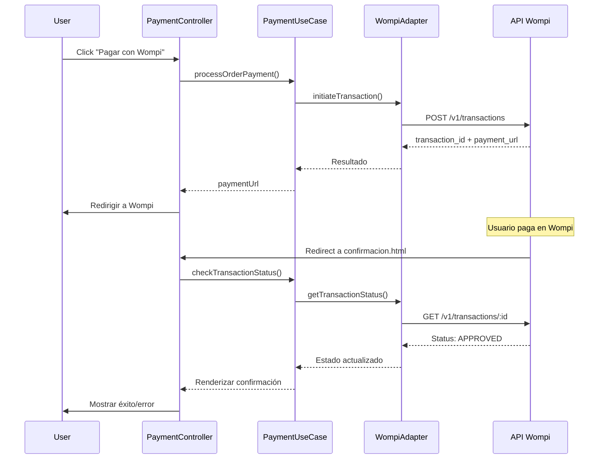

# MisajoCookies - Documentación de Integración Wompi y SEO Local

## 📋 Tabla de Contenidos

1. [Arquitectura Hexagonal](#arquitectura-hexagonal)
2. [Integración con Wompi](#integración-con-wompi)
3. [SEO Local para Cali](#seo-local-para-cali)
4. [Estructura del Proyecto](#estructura-del-proyecto)
5. [Guía de Uso](#guía-de-uso)

---

## 🏗️ Arquitectura Hexagonal

El proyecto sigue el patrón de **Arquitectura Hexagonal** (Ports & Adapters) para garantizar:

- **Desacoplamiento total** entre lógica de negocio y dependencias externas
- **Testabilidad** mejorada mediante interfaces claras
- **Mantenibilidad** al permitir cambiar implementaciones sin afectar el núcleo

### Capas Implementadas

```
src/
├── domain/                    # NÚCLEO - Sin dependencias externas
│   ├── entities/              # Entidades de negocio (Order, Product, Combo)
│   ├── value-objects/         # Objetos de valor inmutables (Money, DeliveryInfo)
│   ├── services/              # Lógica de negocio pura (PricingService, PromotionService)
│   └── ports/                 # Interfaces abstractas (Repository pattern)
│       ├── OrderRepository.js
│       ├── PaymentRepository.js    ← NUEVO: Puerto para pagos
│       ├── CatalogRepository.js
│       └── DeliveryRepository.js
│
├── application/               # CASOS DE USO - Orquestación
│   ├── use-cases/
│   │   ├── OrderUseCase.js
│   │   ├── PaymentUseCase.js     ← NUEVO: Gestión de pagos
│   │   ├── CatalogUseCase.js
│   │   └── DeliveryUseCase.js
│   └── ports/                 # Output Ports (interfaces de salida)
│
├── infrastructure/            # ADAPTADORES - Implementaciones concretas
│   ├── adapters/
│   │   ├── external/
│   │   │   └── WompiPaymentAdapter.js  ← NUEVO: Integración Wompi
│   │   ├── web/
│   │   │   └── LocalSEOService.js      ← NUEVO: SEO Local
│   │   └── database/
│   └── config/
│       └── AppConfig.js                ← ACTUALIZADO: Config Wompi + SEO
│
└── ui/                        # INTERFAZ DE USUARIO
    ├── controllers/
    │   ├── PaymentController.js        ← NUEVO: Controlador de pagos
    │   ├── OrderController.js
    │   └── CatalogController.js
    └── components/
```

### Flujo de Dependencias

```
UI → Application → Domain ← Infrastructure
     (depende)   (puro)    (implementa)
```

---

## 💳 Integración con Wompi

### Configuración Inicial

1. **Obtener credenciales de Wompi:**
   - Sandbox: https://sandbox.wompi.co/
   - Producción: https://wompi.co/

2. **Configurar variables de entorno:**

```javascript
// .env (no commitear a producción)
VITE_WOMPI_PUBLIC_KEY=pub_test_xxxxx
VITE_WOMPI_PRIVATE_KEY=prv_test_xxxxx
VITE_WOMPI_SANDBOX=true
```

### Componentes Implementados

#### 1. PaymentRepository (Domain Port)
`src/domain/ports/PaymentRepository.js`

Define el contrato para cualquier implementación de pasarela de pago:

```javascript
export class PaymentRepository {
    async initiateTransaction(paymentData) { }
    async getTransactionStatus(transactionId) { }
    async updateTransactionStatus(transactionId, status) { }
    async processRefund(transactionId, amount) { }
    async getOrderTransactions(orderId) { }
}
```

#### 2. WompiPaymentAdapter (Infrastructure)
`src/infrastructure/adapters/external/WompiPaymentAdapter.js`

Implementación concreta que comunica con la API de Wompi:

```javascript
const wompiAdapter = new WompiPaymentAdapter({
    publicKey: 'pub_test_xxxxx',
    privateKey: 'prv_test_xxxxx',
    sandbox: true
});

// Iniciar transacción
const result = await wompiAdapter.initiateTransaction({
    orderId: 'ORDER-123',
    amountCents: 5000000, // $50.000 COP
    customerEmail: 'cliente@email.com',
    customerName: 'Juan Pérez',
    customerPhone: '3001234567'
});

// Redirigir a Wompi
window.location.href = result.paymentUrl;
```

#### 3. PaymentUseCase (Application)
`src/application/use-cases/PaymentUseCase.js`

Orquesta la lógica de pagos independientemente del proveedor:

```javascript
const paymentUseCase = new PaymentUseCase(wompiAdapter);

// Procesar pago
const result = await paymentUseCase.processOrderPayment(
    { id: 'ORDER-123', totalCents: 5000000 },
    { email: 'cliente@email.com', name: 'Juan Pérez' }
);

if (result.success) {
    window.location.href = result.paymentUrl;
}
```

#### 4. PaymentController (UI)
`src/ui/controllers/PaymentController.js`

Maneja la interacción del usuario con el sistema de pagos:

```javascript
const controller = new PaymentController(paymentUseCase);

// Iniciar checkout desde formulario
await controller.initiateCheckout(orderData, customerData);

// Verificar estado después de redirección
await controller.verifyPaymentStatus(transactionId);
```

### Flujo de Pago Completo



### Webhooks (Actualización en Tiempo Real)

Para recibir notificaciones de Wompi:

1. **Configurar webhook en dashboard de Wompi:**
   ```
   URL: https://www.misajocookies.com/api/webhooks/wompi
   Eventos: transaction.updated
   ```

2. **Procesar webhook:**

```javascript
// Endpoint del servidor (requiere backend Node.js)
app.post('/api/webhooks/wompi', async (req, res) => {
    const { transaction_id, status } = req.body;
    
    const paymentUseCase = new PaymentUseCase(wompiAdapter);
    await paymentUseCase.processWebhookNotification({
        transactionId: transaction_id,
        status: status,
        metadata: req.body
    });
    
    res.status(200).send('OK');
});
```

### Página de Confirmación

`pedidos/confirmacion.html` - Página optimizada con:
- SEO técnico (noindex para evitar duplicación)
- Schema.org para Order
- Estados visuales de pago (Aprobado, Rechazado, Pendiente)
- Botones de acción post-pago

---

## 🌍 SEO Local para Cali, Colombia

### Componentes Implementados

#### 1. LocalSEOService (Infrastructure)
`src/infrastructure/adapters/web/LocalSEOService.js`

Genera dinámicamente todos los metadatos para SEO local:

```javascript
const seoService = new LocalSEOService({
    businessName: 'MisajoCookies',
    city: 'Cali',
    region: 'Valle del Cauca',
    country: 'CO',
    coordinates: { latitude: 3.4516, longitude: -76.5320 }
});

// Generar Schema.org completo
const schema = seoService.generateLocalBusinessSchema();

// Generar meta tags OpenGraph
const ogTags = seoService.generateOpenGraphTags({
    title: 'Galletas Artesanales en Cali',
    description: 'Domicilios de galletas en Cali',
    image: 'https://misajocookies.com/og-image.jpg'
});

// Keywords específicas para Cali
const keywords = seoService.getCaliKeywords('chocochips');
// ['galletas artesanales Cali', 'cookies Cali', 'galletas chocoChips Cali', ...]
```

### Estrategia de Palabras Clave

#### Keywords Principales
- `galletas artesanales Cali`
- `repostería artesanal Cali`
- `domicilios de galletas Cali`
- `alfajores Cali`
- `cookies caseras Cali`

#### Keywords por Categoría
| Categoría | Keywords Específicas |
|-----------|---------------------|
| ChocoChips | `galletas chocoChips Cali`, `cookies con chocolate Cali` |
| Mantequilla | `galletas de mantequilla Cali`, `galletas tradicionales Cali` |
| Alfajores | `alfajores artesanales Cali`, `alfajores rellenos Cali` |
| Combos | `combos de galletas Cali`, `regalos de galletas Cali` |

### Schema.org Implementado

#### LocalBusiness (Todas las páginas)
```json
{
  "@context": "https://schema.org",
  "@type": "LocalBusiness",
  "name": "MisajoCookies",
  "address": {
    "addressLocality": "Cali",
    "addressRegion": "Valle del Cauca",
    "addressCountry": "CO"
  },
  "geo": {
    "latitude": 3.4516,
    "longitude": -76.5320
  },
  "areaServed": {
    "@type": "City",
    "name": "Cali"
  },
  "paymentAccepted": "Cash, Transfer, Credit Card (Wompi)"
}
```

#### Product (Páginas de producto)
```json
{
  "@type": "Product",
  "name": "Galletas ChocoChips",
  "offers": {
    "priceCurrency": "COP",
    "price": "25000",
    "availability": "https://schema.org/InStock",
    "seller": {
      "@type": "LocalBusiness",
      "name": "MisajoCookies"
    }
  }
}
```

### Meta Tags Geo

```html
<meta name="geo.region" content="CO-VAC">
<meta name="geo.placename" content="Cali">
<meta name="geo.position" content="3.4516;-76.5320">
<meta name="ICBM" content="3.4516, -76.5320">
```

---

## 📁 Estructura del Proyecto

```
/workspace
├── src/
│   ├── domain/
│   │   ├── entities/
│   │   │   ├── Order.js
│   │   │   ├── OrderItem.js
│   │   │   ├── Product.js
│   │   │   └── Combo.js
│   │   ├── value-objects/
│   │   │   ├── Money.js
│   │   │   └── DeliveryInfo.js
│   │   ├── services/
│   │   │   ├── PricingService.js
│   │   │   └── PromotionService.js
│   │   └── ports/
│   │       ├── OrderRepository.js
│   │       ├── PaymentRepository.js ⭐
│   │       ├── CatalogRepository.js
│   │       └── DeliveryRepository.js
│   │
│   ├── application/
│   │   ├── use-cases/
│   │   │   ├── OrderUseCase.js
│   │   │   ├── PaymentUseCase.js ⭐
│   │   │   ├── CatalogUseCase.js
│   │   │   └── DeliveryUseCase.js
│   │   └── ports/
│   │
│   ├── infrastructure/
│   │   ├── adapters/
│   │   │   ├── external/
│   │   │   │   └── WompiPaymentAdapter.js ⭐
│   │   │   ├── web/
│   │   │   │   └── LocalSEOService.js ⭐
│   │   │   └── database/
│   │   └── config/
│   │       └── AppConfig.js ✏️
│   │
│   └── ui/
│       ├── controllers/
│       │   ├── PaymentController.js ⭐
│       │   ├── OrderController.js
│       │   └── CatalogController.js
│       └── components/
│
├── pedidos/
│   ├── index.html
│   └── confirmacion.html ⭐
│
├── productos/
│   └── *.html (con SEO optimizado)
│
└── index.html (con SEO local completo)
```

**Leyenda:**
- ⭐ = Archivo nuevo creado en esta refactorización
- ✏️ = Archivo existente modificado

---

## 🚀 Guía de Uso

### 1. Configurar Wompi

```bash
# Copiar archivo de ejemplo
cp .env.example .env

# Editar con credenciales reales
# VITE_WOMPI_PUBLIC_KEY=pub_prod_xxxxx
# VITE_WOMPI_PRIVATE_KEY=prv_prod_xxxxx
# VITE_WOMPI_SANDBOX=false
```

### 2. Inicializar Sistema de Pagos

```javascript
// En tu archivo principal JS
import { AppConfig } from './src/infrastructure/config/AppConfig.js';
import { WompiPaymentAdapter } from './src/infrastructure/adapters/external/WompiPaymentAdapter.js';
import { PaymentUseCase } from './src/application/use-cases/PaymentUseCase.js';
import { PaymentController } from './src/ui/controllers/PaymentController.js';

// Validar configuración
const validation = AppConfig.validatePaymentConfig();
if (!validation.isValid) {
    console.warn('Configuración incompleta:', validation.warnings);
}

// Inicializar
const wompiAdapter = new WompiPaymentAdapter(AppConfig.getWompiConfig());
const paymentUseCase = new PaymentUseCase(wompiAdapter);
const paymentController = new PaymentController(paymentUseCase);

// Exponer globalmente si es necesario
window.paymentController = paymentController;
```

### 3. Implementar Checkout

```html
<!-- Formulario de checkout -->
<form id="checkout-form">
    <input type="email" id="customer-email" required>
    <input type="text" id="customer-name" required>
    <input type="tel" id="customer-phone">
    <button type="submit">Pagar con Wompi</button>
</form>

<script type="module">
    document.getElementById('checkout-form').addEventListener('submit', async (e) => {
        e.preventDefault();
        
        const orderData = {
            id: 'ORDER-' + Date.now(),
            totalCents: 5000000 // $50.000 COP
        };
        
        const customerData = {
            email: document.getElementById('customer-email').value,
            name: document.getElementById('customer-name').value,
            phone: document.getElementById('customer-phone').value
        };
        
        await window.paymentController.initiateCheckout(orderData, customerData);
    });
</script>
```

### 4. Optimizar SEO por Página

```javascript
import { AppConfig } from './src/infrastructure/config/AppConfig.js';
import { LocalSEOService } from './src/infrastructure/adapters/web/LocalSEOService.js';

const seoService = new LocalSEOService(AppConfig.getLocalSeoConfig());

// Para página de producto
const productSEOTags = seoService.generateCompleteSEOTags({
    title: 'Galletas ChocoChips - MisajoCookies Cali',
    description: 'Deliciosas galletas ChocoChips artesanales en Cali. Domicilios a toda la ciudad.',
    keywords: seoService.getCaliKeywords('chocochips'),
    image: 'https://misajocookies.com/assets/images/chocochips.webp',
    type: 'product',
    id: 'galletas-chocochips',
    priceCents: 2500000
});

// Insertar en <head>
document.head.insertAdjacentHTML('beforeend', productSEOTags);
```

---

## 🔒 Seguridad

### Buenas Prácticas Implementadas

1. **Nunca exponer `privateKey` en frontend**
   - Solo usar en backend/webhooks
   - Frontend solo usa `publicKey`

2. **Validación de datos**
   - Email válido requerido
   - Montos positivos verificados
   - Referencias únicas generadas

3. **HTTPS obligatorio en producción**
   - Configurar en servidor
   - Wompi requiere HTTPS para webhooks

4. **Sanitización de inputs**
   - Escape HTML en meta tags
   - Validación de tipos de datos

---

## 📊 Métricas de Calidad

| Principio | Cumplimiento |
|-----------|-------------|
| SOLID - SRP | ✅ Cada archivo tiene una responsabilidad única |
| SOLID - OCP | ✅ Nuevos métodos de pago sin modificar core |
| SOLID - LSP | ✅ WompiAdapter sustituye PaymentRepository |
| SOLID - ISP | ✅ Interfaces pequeñas y específicas |
| SOLID - DIP | ✅ Dependencias apuntan hacia el dominio |
| Clean Code | ✅ JSDoc completo, nombres semánticos |
| SEO Local | ✅ Schema.org, Geo Tags, Keywords Cali |

---

## 📞 Soporte

- **Documentación Wompi:** https://docs.wompi.co/
- **Dashboard Wompi:** https://dashboard.wompi.co/
- **Soporte Técnico:** contacto@misajocookies.com

---

*Documento generado como parte de la refactorización bajo Arquitectura Hexagonal - MisajoCookies © 2024*
